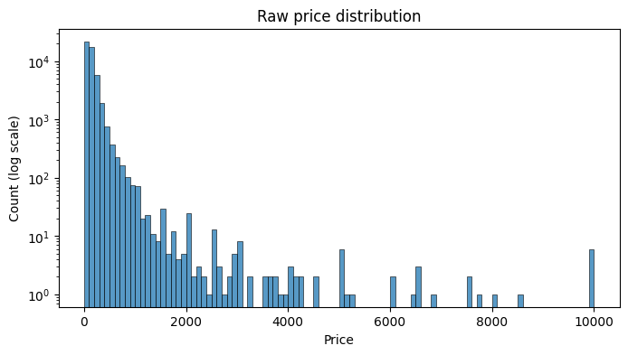
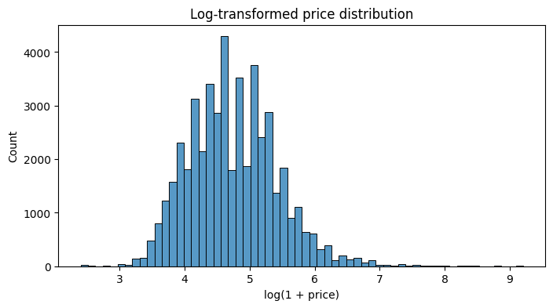
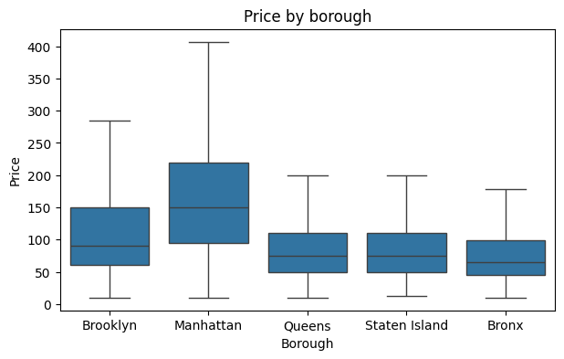
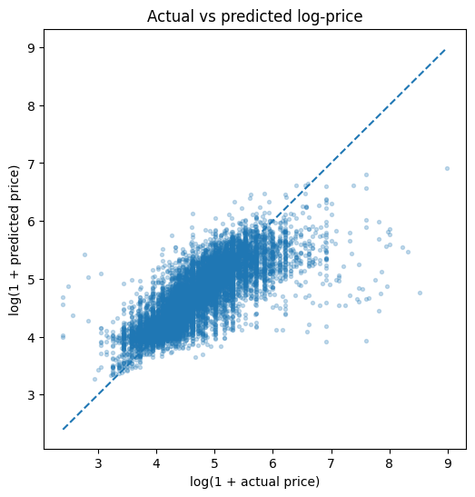
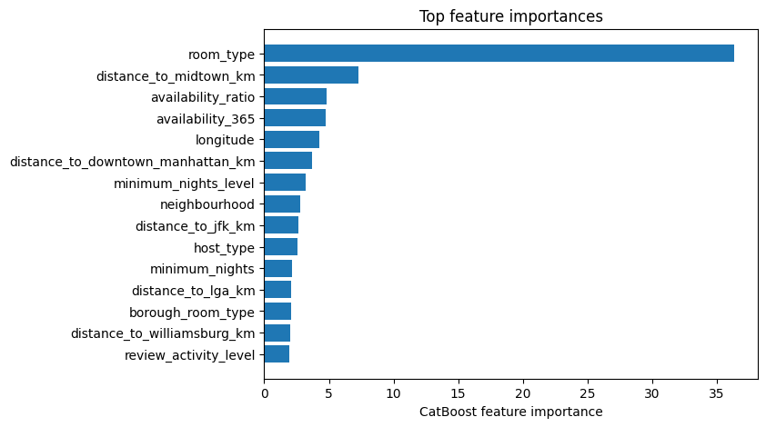

# Airbnb NYC Price Prediction

This project predicts nightly Airbnb listing prices in New York City using the Kaggle **New York City Airbnb Open Data** dataset. The main goal is not only to minimize error, but to understand where a static tabular model is reliable, where it fails, and what that says about the limits of the available features.

Dataset: [New York City Airbnb Open Data](https://www.kaggle.com/datasets/dgomonov/new-york-city-airbnb-open-data)  
Rows: ~48,900 listings  
Target: `price`

## Methodology

The target is strongly right-skewed, with a small number of very expensive listings. For that reason, models are trained on `log1p(price)` and converted back to dollars for evaluation.





Key modeling choices:

- Baselines were built first: global median, median by room type, and median by borough plus room type.
- Linear and tree benchmarks were tested: Ridge, Huber regression, and Random Forest.
- The final model is a tuned CatBoost regressor, chosen because it handles categorical features well and performed best on held-out data.
- Feature engineering focused on location, room type, review behavior, availability, host scale, and distances to NYC anchor points such as Midtown, Downtown Manhattan, Williamsburg, JFK, LGA, and Central Park.
- Outlier and segment diagnostics were treated as interpretation tools, not just ways to improve scores.



## Results

The best model is the tuned CatBoost regressor.

| Model | MAE | RMSE | MedAE | RMSLE | R2 |
|---|---:|---:|---:|---:|---:|
| Tuned CatBoost | **54.83** | **176.46** | 23.44 | **0.432** | **0.222** |
| Random Forest | 55.45 | 177.76 | **23.38** | 0.438 | 0.211 |
| CatBoost | 55.71 | 179.69 | 23.98 | 0.438 | 0.193 |
| Huber regression | 58.57 | 187.55 | 24.66 | 0.473 | 0.121 |
| Ridge | 59.19 | 185.56 | 26.70 | 0.469 | 0.140 |
| Median by borough and room type | 63.51 | 192.20 | 30.00 | 0.520 | 0.077 |
| Global median | 82.73 | 205.10 | 46.00 | 0.696 | -0.051 |

Compared with the strongest median baseline, the tuned CatBoost model reduces MAE from **63.51** to **54.83**, an improvement of about **13.7%**. Compared with the global median baseline, MAE improves by about **33.7%**.

The modest R2 is important: the model improves prediction accuracy, but the dataset is missing major price drivers such as amenities, listing photos, seasonality, events, cleaning fees, and real-time demand.



## Interpretation

The most important feature is `room_type`, followed by location and availability-related variables. Distance to Midtown, longitude, neighbourhood, borough-room interactions, and airport/landmark distances all contribute meaningful signal.



The model performs much better on typical listings than on luxury listings:

| Segment | MAE | RMSE | Count | Mean residual |
|---|---:|---:|---:|---:|
| Typical listings | 34.40 | 50.58 | 9,292 | -1.57 |
| Luxury listings | 446.11 | 760.70 | 485 | 442.84 |

Luxury listings are systematically underpredicted. A two-stage approach with a luxury classifier and separate regressors was tested, but it did not beat the global CatBoost model on held-out data. The final model therefore remains the tuned global CatBoost model, while segmentation is kept as a diagnostic finding.

## Uncertainty

Conformal prediction intervals were also tested:

| Method | Coverage | Average width |
|---|---:|---:|
| Global conformal | 89.7% | $180.59 |
| Segment-wise conformal | 87.1% | $174.09 |

The global conformal interval is more reliable in this run because it gets close to the intended 90% coverage.

## Repository Structure

- `notebooks/airbnb_nyc_price_prediction_final.ipynb` - final analysis and modeling notebook
- `notebooks/legacy/` - earlier notebook exports and versions
- `images/` - README figures
- `models/` - saved model artifacts
- `data/` - dataset files
- `requirements.txt` - Python dependencies

## Run

```bash
pip install -r requirements.txt
```

Then open and run:

```text
notebooks/airbnb_nyc_price_prediction_final.ipynb
```
